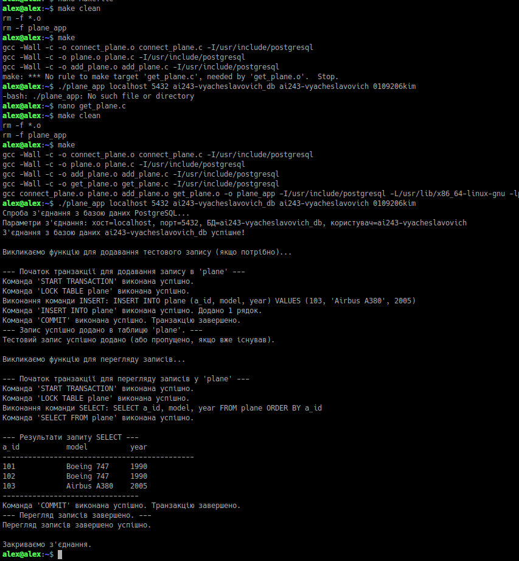

## «Етапи компіляції С-програм та автоматизація побудови С-програм»

Рис. 1 - "2.1.1 Якщо робота виконується на локальній віртуальній машині (локальна ОС
Linux), тоді встановити в ОС Linux програмний пакунок libpq-dev."

Рис. 2 - "2.1.2 Створити C-програму з назвою «db_connect.c», яка:
− встановлює з`єднання із СКБД PostgreSQL (IP-адреса=localhost, порт=5432);
− під час з’єднання використовує назву БД, ім’я користувача та пароль з
попередньої лабораторної роботи, які вбудовані у програмний код;
− обробляє результат з’єднання (успішне та помилкове), виводячи на екран
відповідні повідомлення, які враховують назву БД;
− увесь програмний код розміщується лише у функції main."

Рис. 3 - "2.1.3 Скомпілювати С-програму, враховуючи каталоги з header-файлами та
бібліотеками СКБД PostgreSQL.
Перевірити роботу executable-файлу."

Рис. 4 - "2.1.4 Створити C-програму з назвою «db_connect_param.c», яка повторює всі дії C-
програми з назвою «db_connect.c», але IP-адресу, порт, назву бази даних, ім’я користувача
та пароль програма повинна брати як параметри командного рядку."

Рис. 5 - "2.1.5 Скомпілювати С-програму, враховуючи каталоги з header-файлами та
бібліотеками СКБД PostgreSQL.
Перевірити роботу executable-файлу за двома варіантами назви БД: правильна назва
БД та будь-яка неправильна назва БД."
### 2.2 Побудова програми з’єднання з СКБД PostgreSQL за модульним принципом програмування

Рис. 6 - 2.2.1 Змінити код С-програми, враховуючи модульний принцип програмування:
− створити С-файл з назвою «connect_назва таблиці.c», який містить програмний
код з’єднання із СКБД PostgreSQL у вигляді функції з назвою «connect_назва таблиці», де
«назва таблиці» - назва реляційної таблиці з попередньої лабораторної роботи;
− створити header-файл за шаблоном «назва таблиці.h» та додати до файлу
декларацію створеної функції;
− створити С-файл з назвою «назва таблиці.c», який містить main-функцію з
викликом функції з назвою «connect_назва таблиці».

Рис. 7 - "2.2.2 Побудувати executable-файл через кроки:
− створити object-файл з назвою «connect_назва таблиці.o» для «connect_назва
таблиці.c», враховуючи каталоги з header-файлами, бібліотеками СКБД PostgreSQL
− створити object-файл з назвою «назва таблиці.o» для файлу «назва таблиці.c»,
враховуючи каталоги з header-файлами, бібліотеками СКБД PostgreSQL
− створити executable-файл з назвою «назва таблиці», враховуючи каталоги з
header-файлами, бібліотеками СКБД PostgreSQL, а також створені object-файли з назвою
«connect_назва таблиці.o» та «назва таблиці.o».
Перевірити роботу executable-файлу."
### 2.3 Побудова програми з’єднання з СКБД PostgreSQL через команду make

Рис. 8 - "2.3.1 Створити Makefile, який містить наступний опис мети:
− мета створення object-файлу з назвою «connect_назва таблиці.o»;
− мета створення object-файлу з назвою «назва таблиці.o»;
− мета створення executable-файлу з назвою «назва таблиці»."

Рис. 9 - "2.3.2 Виконати команду make для побудови програми."
### 2.4 Побудова програми додавання рядку реляційної таблиці

Рис. 10 - "2.4.1 Створити файл як програмний модуль з назвою «add_назва таблиці.с» із
описом функції додавання рядку реляційної таблиці, яка повинна містити:
− команди транзакції (START TRANSACTION, LOCK TABLE назва таблиці ...,
INSERT INTO назва таблиці ..., COMMIT);
− повідомлення про результат виконання кожної команди.
Команду INSERT INTO створити за прикладом з попередньої лабораторної роботи."

Рис 11 - "2.4.2 Оновити раніше створені файли:
− додати до файлу «назва таблиці.h» декларацію нової функції;
− виконати виклик нової функції із main-фукції файлу «назва таблиці.c»
− додати опис нової мети у файл Makefile"

Рис 12 - "2.4.3 Скомпілювати С-файли програмних модулів командою make."
### 2.5 Побудова програми перегляду рядків реляційної таблиці

Рис 13 - "2.5.1 Створити файл як програмний модуль з назвою «get_назва таблиці».с із описом
функції перегляду рядків реляційної таблиці, яка повинна містити:
− команди транзакції (START TRANSACTION, LOCK TABLE назва таблиці ...,
SELECT ... FROM назва таблиці ..., COMMIT);
− повідомлення про результат виконання кожної команди.
Команду SELECT ... FROM створити за прикладом з попередньої лабораторної
роботи."

Рис 14 - "2.5.2 Оновити раніше створені файли:
− додати до файлу «назва таблиці».h декларацію нової функції;
− виконати виклик нової функції із main-функції файлу «назва таблиці».c
− додати опис нової мети у файл Makefile"

Рис 15 - "2.5.3 Скомпілювати С-файли програмних модулів командою make.
Перевірити роботу executable-файлу."
### 2.6 Додаткове налаштування процесу керування файлами через команду make

Рис 16 - "2.6.1 Додати до файлу Makefile наступні описи мети:
install – копіювання executable-файлу до каталогу bin домашнього каталогу
поточного користувача, наприклад, /home/blazhko/bin/ (попередньо створити такий
каталог);
clean – видалення всіх object-файлів та executable-файлу."

Рис 17 - "2.6.2 Виконати команду make з метою clean.
Перевірити відсутність всіх object-файлів та executable-файлу."

Рис 18 - "2.6.3 Скомпілювати С-файли програмних модулів командою make."

Рис 19 - "2.6.4 Виконати команду make з метою install.
Перевірити наявність executable-файлу у відповідному каталозі."

Рис 20 - "2.6.5 Повторо скомпілювати С-файли програмних модулів командою make. Надати
висновки щодо повідомлення команди."
### 2.7 Огляд етапів побудови С-програми GNU-компілятором GCC

Рис 21 - "2.7.1 Виконати prepocessing-етап для вказаного файлу, зберігши результат у файлі
«назва таблиці.i»."

Рис 22 - "2.7.2 Виконати compilation-етап для файлу «назва таблиці.i», зберігши результат у
файлі «назва таблиці.s»."
Рис 23 - "2.7.3 Повторити compilation-етап для файлу «назва таблиці.i» з оптимізацію
програмного коду, зберігши результат у файлі «назва таблиці_opt.s», та визначити відсоток
зменшення кількості рядків після оптимізації."

Рис 24 - "2.7.4 Виконати assembly-етап для файлу «назва таблиці.i» та зберегти результат у
object-файлі «назва таблиці.o»."

Рис 25 - "2.7.5 Визначити командний рядок виконання linking-етапу для файлу «назва
таблиці.o»."

Рис 26 - "2.7.6 Виконати linking-етап для файлу «назва таблиці.o» та зберегти результат у
executable-файлі «назва таблиці»."

Рис 27 - "2.7.7 Переглянути список файлів динамічних бібліотек, пов’язаних зі створеним
executable-файлом."
