## «Програмування міжпроцесної взаємодії з використанням каналів, черг повідомлень та програмування багатопоточної взаємодії»
### 2.1 Використання черг повідомлень для процесів, які взаємодіють з однією БД під керуванням серверу СКБД PostgreSQL
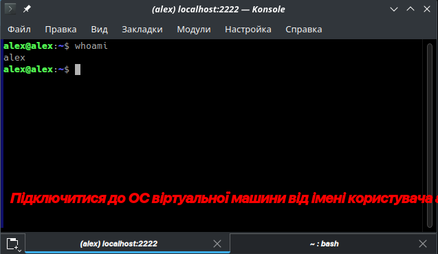
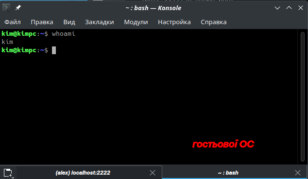
Рис. 1 - "2.1.1 Підключитись до ОС від імені користувача, який використано у лабораторній
роботі No12."
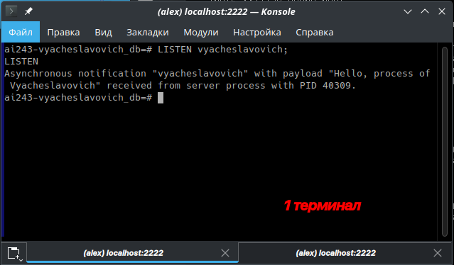
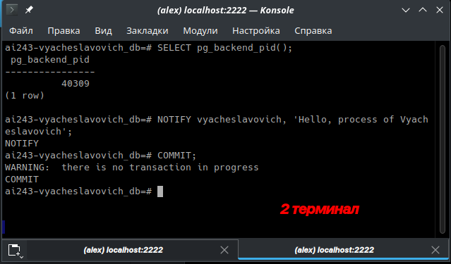
Рис. 2 - "2.1.2 Забезпечити обмін повідомленнями між двома процесами-копіями серверів
СКБД PostgreSQL, використовуючи команду LISTEN для програми-споживача та команду
NOTIFY для програми-постачальника через утиліту psql та враховуючи, що:
− назва черги повідомлень співпадає з вашим прізвищем в транслітерації,
наприклад, blazhko;
− рядок повідомлення = "Hello, process of Surname”, наприклад, "Hello, process of
Blazhko”;
− у псевдотерміналі програми-постачальника отримати PID процесу-копії серверу
СКБД;
− у псевдотерміналі програми-споживача отримати перелік назв черг повідомлень,
до яких програма може отримувати доступ."
### 2.2 Програмна реалізація неіменованих каналів
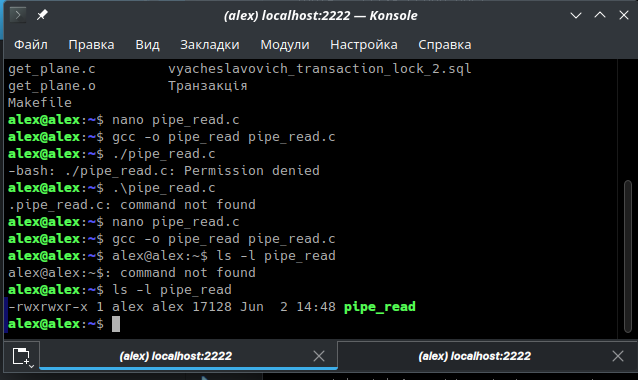
Рис. 3 - "2.2.1 Створити програму на мові С з назвою pipe_read яка виконує дії:
− отримує повідомлення з неіменоваго каналу з використанням значення, яке
передано до програми через аргумент командного рядку;
− виводить на екран повідомлення типу "I`m child process of Surname with pid=",
наприклад, " I`m child process of Blazhko with pid=" зі значенням свого PID;
− виводить на екран повідомлення, в якому вказано розмір повідомлення,
отриманого раніше з каналу."
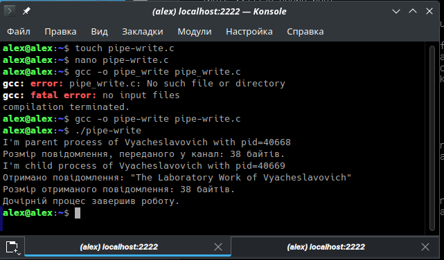
Рис. 4 - "2.2.2 Створити програму на мові С з назвою pipe_write, яка виконує дії:
− створює неіменований канал;
− створює child-процес, в якому завантажується новий програмний образ з
викликом програми pipe_read та її аргументом;
− parent-процес передає у канал повідомлення типу "The Laboratory Work of
Surname", наприклад, " The Laboratory Work of Blazhko";
− parent-процес виводить на екран повідомлення типу "I`m parent process of
Surname with pid=", наприклад, " I`m parent process of Blazhko with pid=" зі значенням свого
PID;
− parent-процес виводить на екран повідомлення, в якому вказано розмір
повідомлення, переданого раніше у канал."
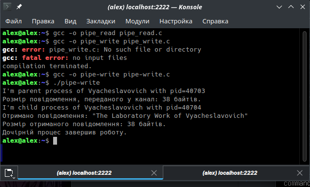
Рис. 4 - "2.2.3 Скомпілювати програми та перевірити їх роботу.
Проаналізувати роботу програм та надати висновок щодо синхронності або
асинхронності їх дій."
### 2.3 Робота з іменованими каналами через інтерпретатор командного рядку
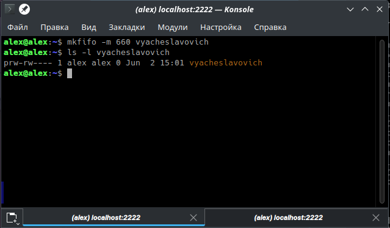
Рис. 5 - "2.3.1 Створити іменований канал з використанням команди mkfifo:
− назва каналу співпадає з вашим прізвищем у транслітерації;
− повноваження доступу до каналу = «можна лише читати та писати власнику та
групі власника».
Переглянути властивості створеного каналу як файлу."
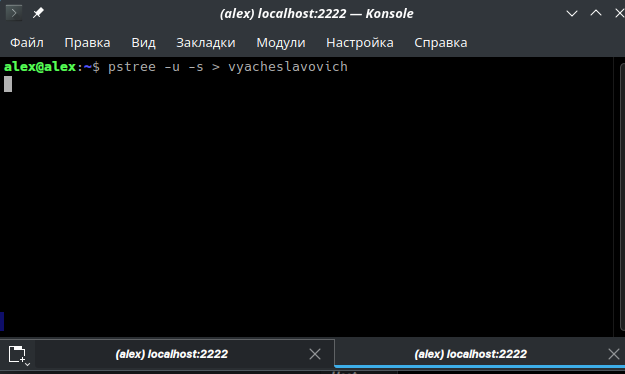
Рис. 6 - "2.3.2 Підключити до іменованого каналу процес, який буде в нього записувати за
командою, визначеною з таблиці за вашим варіантом."
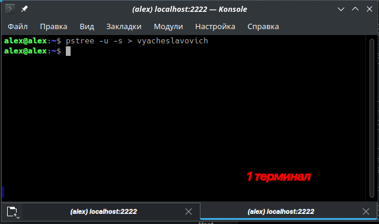
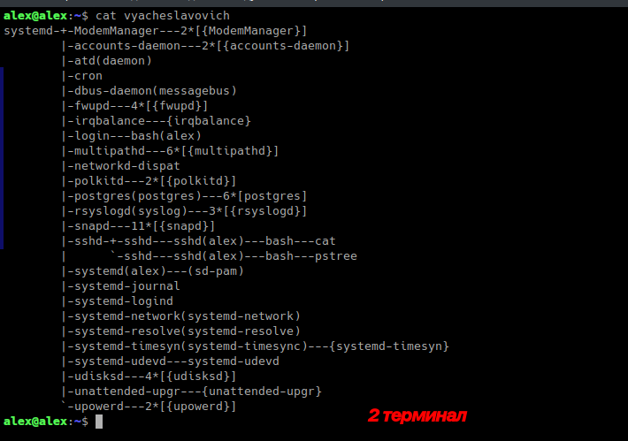
Рис. 7 - "2.3.3 Перейти до нового (2-го) псевдотерміналу роботи з ОС Linux та створити
процес, який буде читати зі створеного раніше каналу.
Проаналізувати роботу процесів та надати висновок щодо синхронності або
асинхронності їх дій."
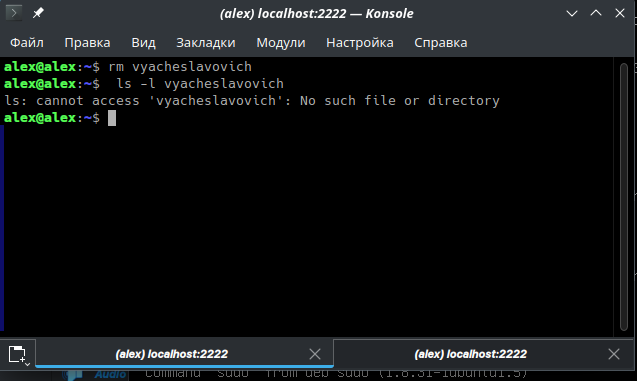
Рис. 8 - "2.3.4 Видалити іменований канал."
### 2.4 Програмна реалізація іменованих каналів
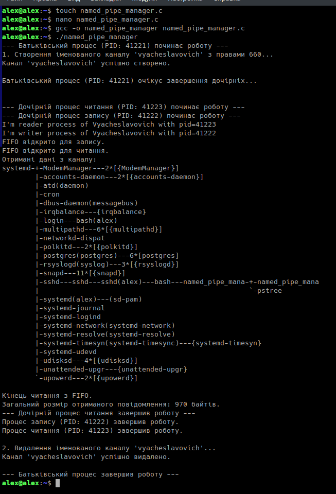
Рис. 9 - "2.4.1 Створити програму на мові С, яка буде створювати іменований канал та
виконувати дії у відповідності з пунктами попередніх завдань 2.3.1, 2.3.2, 2.3.4"
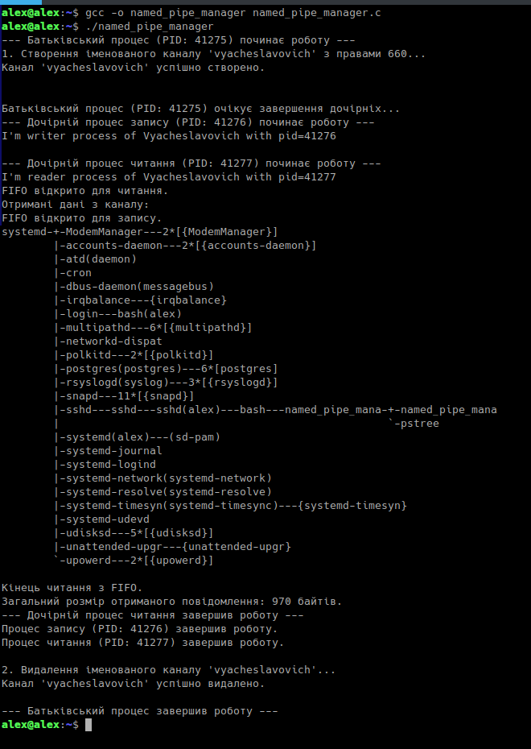
Рис. 10 - "2.4.2 Скомпілювати програму та перевірити її роботу, враховуючи пункт завдання"
### 2.5 Програмування черги повідомлень
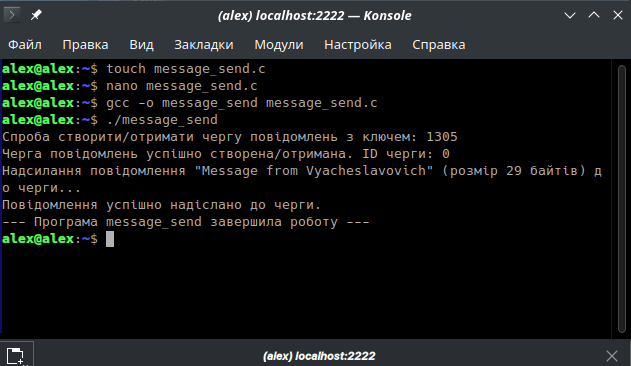
Рис. 11 - "2.2.1 Створити програму на мові С з назвою message_send, яка виконує дії:
− створює чергу, номер якої = (1000 + 100*m+n), де m = {1,2,3,4,5,6} – остання
цифра у номері вашої групи, n – номер вашого варіанту (важливо, щоб цей номер ще не
використовувався іншими студентами, інакше можлива помилка у зв`язку із обмеженням
повноважень доступу на вже кимось створену чергу, тоді оберіть інший номер);
− передає до черги повідомлення типу "Message from Surname", наприклад,
"Message from Blazhko"
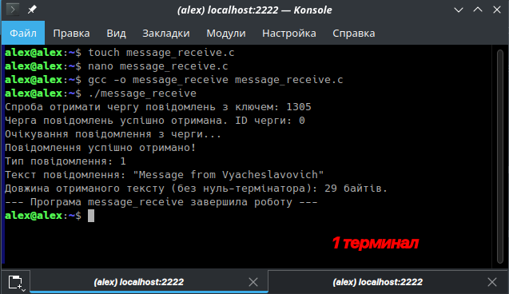
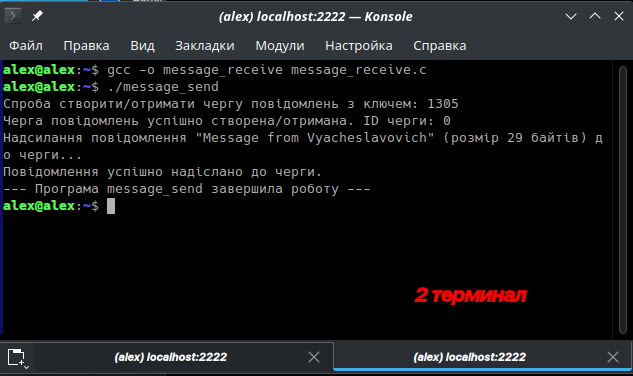
Рис. 12 - "2.2.2 Створити програму на мові С з назвою message_receive, яка отримує
повідомлення з черги , номер якої =(1000 + 100*m+n), де m ={1,2,3,4,5,6} – остання цифра
у номері вашої групи, n – номер вашого варіанту."

Рис. 13 - "2.2.3 Скомпілювати програми та перевірити їх роботу.
Проаналізувати роботу програм та надати висновок щодо синхронності або
асинхронності їх дій."
### 2.6 Програмування потоків
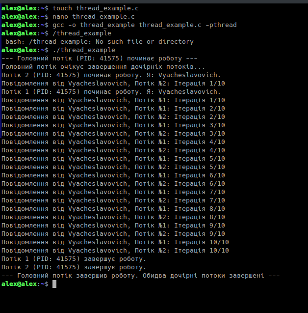
Рис. 14 - "2.6.1 Створити програму на мові C за прикладом з рисунку 12, в якій функції двох
потоків:
− виводять на екран повідомлення, які враховують ваше прізвище транслітерацією
та номер функції;
− повідомлення виводиться (n+5) разів, де n – номер варіанту."

Рис. 15 - "2.6.2 Скомпілювати програму та перевірити її роботу."
