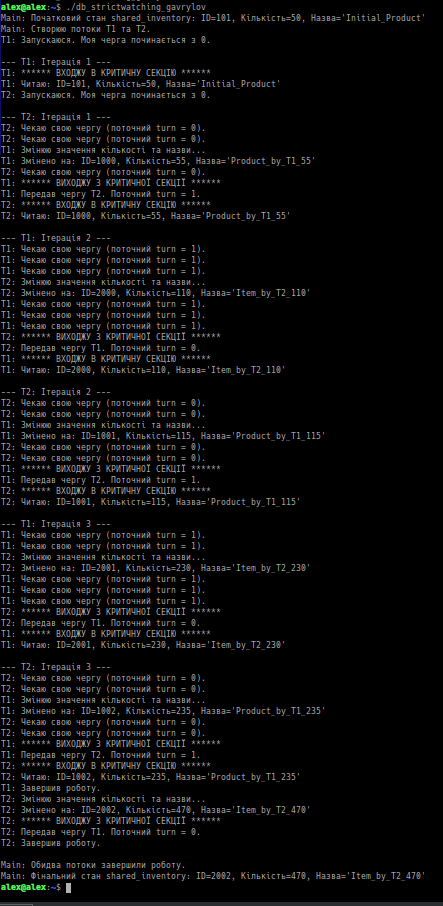

## «Програмування безпечної міжпроцесної та міжпотокової взаємодії в Unix-подібних ОС»
### 2.1 Аналіз наявності змагань у міжпотоковій взаємодії на основі алгоритму «Змінні блокування»

Рис. 1 - "2.1.1. В лабораторній роботі No11 було використано таблицю реляційної бази даних.
Для проведення експериментів над механізмами взаємного виключення декількох потоків
під час паралельного доступу до структурної змінної з використанням алгоритму «Змінні
блокування» створити С-програму за прикладом на рисунку 14 та назвою за шаблоном
«db_lockvars_ваше_прізвище.c», яка містить:
 опис структурної змінної, який відповідає структурі реляційної таблиці;
 налаштування роботи двох потоків через окремі функції з назвою T1,T2;
 структури даних роботи алгоритму «Змінні блокування» в програмному коді
потокових функцій;
 кожна функція повинна:
o спочатку виконати операцію читання значення будь-якого елемента структури;
o в подальшому виконати операцію зміни значення вказаного елемента структури;
 функції затримки для імітації паралельної роботи потоків."

Рис. 2 - "2.1.2. Скомпілювати програму та перевірити її роботу. Зробити висновок щодо
наявності або відсутності змагань потоків."
### 2.2 Аналіз наявності змагань у міжпотоковій взаємодії на основі алгоритму «Строге чергування»

Рис. 3 - "2.2.1. Для проведення експериментів над механізмами взаємного виключення
декількох потоків під час паралельного доступу до структурної змінної з використанням
алгоритму «Строге чергування» створити С-програму з назвою за шаблоном
«db_strictwatching_ваше_прізвище.c», яка містить:
 опис структурної змінної, який відповідає структурі реляційної таблиці;
 налаштування роботи двох потоків через окремі функції з назвою T1,T2;
 структури даних роботи алгоритму «Строге чергування» в програмному коді
потокових функцій;
 кожна функція повинна:
o спочатку виконати операцію читання значення будь-якого елемента структури;
o в подальшому виконати операцію зміни значення вказаного елемента структури;
 функції затримки для імітації паралельної роботи потоків."

Рис. 4 - "2.2.2. Скомпілювати програму та перевірити її роботу. Зробити висновок щодо
наявності або відсутності змагань потоків."
### 2.3 Аналіз наявності змагань у міжпотоковій взаємодії на основі алгоритму Петерсона

Рис. 5 - "2.3.1. Для проведення експериментів над механізмами взаємного виключення
декількох потоків під час паралельного доступу до структурної змінної з використанням
алгоритму Петерсона створити С-програму з назвою за шаблоном
«db_peterson_ваше_прізвище.c», яка містить:
 опис структурної змінної, який відповідає структурі реляційної таблиці;
 налаштування роботи двох потоків через окремі функції з назвою T1,T2;
 кожна функція повинна:
o спочатку виконати операцію читання значення будь-якого елемента структури;
o в подальшому виконати операцію зміни значення вказаного елемента структури;
 структури даних роботи алгоритму Петерсона в програмному коді потокових
функцій;
 функції затримки для імітації паралельної роботи потоків."

Рис. 6 - "2.3.2. Скомпілювати програму та перевірити її роботу. Зробити висновок щодо
наявності або відсутності змагань потоків."
### 2.4 Аналіз наявності змагань у міжпотоковій взаємодії на основі двійкового семафору

Рис. 7 - "2.4.1. Для проведення експериментів над механізмами взаємного виключення
декількох потоків під час паралельного доступу до структурної змінної з використанням
двійкового семафору створити С-програму з назвою за шаблоном
«db_semaphore2_ваше_прізвище.c», яка містить:
 опис структурної змінної, який відповідає структурі реляційної таблиці;
 налаштування роботи двох потоків через окремі функції з назвою T1,T2;
 кожна функція повинна:
o спочатку виконати операцію читання значення будь-якого елемента структури;
o в подальшому виконати операцію зміни значення вказаного елемента структури;
 назва семафору співпадає з вашим прізвищем транслітерацією;
 права доступу при відкритті семафору = можна читати, писати та виконувати
власнику та групі власника;
 функції керування семафором;
 функції затримки для імітації паралельної роботи потоків."

Рис. 8 - "2.4.2. Скомпілювати програму та перевірити її роботу. Зробити висновок щодо
наявності або відсутності змагань потоків."
### 2.5 Аналіз наявності змагань у міжпотоковій взаємодії на основі м’ютексу

Рис. 9 - "2.5.1. Для проведення експериментів над механізмами взаємного виключення
декількох потоків під час паралельного доступу до структурної змінної з використанням
м’ютексу створити С-програму з назвою за шаблоном «db_mutex_ваше_прізвище.c»:
 опис структурної змінної, який відповідає структурі реляційної таблиці;
 налаштування роботи двох потоків через окремі функції з назвою T1,T2;
 кожна функція повинна:
o спочатку виконати операцію читання значення будь-якого елемента структури;
o в подальшому виконати операцію зміни значення вказаного елемента структури;
 функції керування м’ютексом;
 функції затримки для імітації паралельної роботи потоків."

Рис. 10 - "2.5.2. Скомпілювати програму та перевірити її роботу. Зробити висновок щодо
наявності або відсутності змагань потоків."
